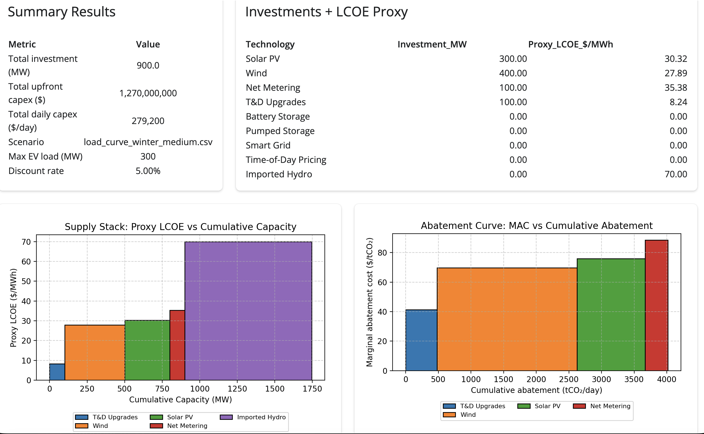
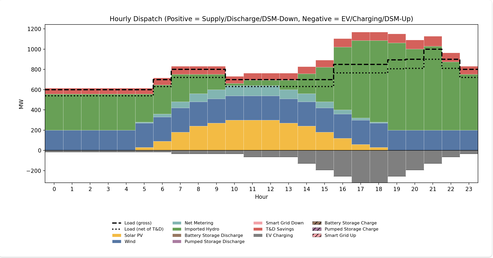

# Investment Optimization Dashboard — Supply, Storage & Demand-Side Planning

[]() []() []() []()


An interactive Shiny for Python application for investment and dispatch optimization in electric power systems, combining generation, storage, demand-side resources, and backstop imports into a transparent planning framework.

## 🚀 Live Demo

https://tonympeluso.shinyapps.io/investment_optimization/

(link placeholder — update once deployed)

## 🌍 Overview

Electric utilities increasingly need transparent, explainable planning tools that bridge the gap between:
- long-term investment decisions
- hourly dispatch realities
- demand-side and non-wires alternatives
- climate and decarbonization objectives

This project implements a daily investment + dispatch optimization model, wrapped in an interactive Shiny UI, allowing planners and analysts to explore:
- how much capacity to build
- which technologies enter the mix
- how resources are dispatched hour-by-hour
- how demand-side measures reshape load
- cost and emissions tradeoffs

The app emphasizes clarity over black-box complexity, making it suitable for:
- utility planning teams
- regulators and stakeholders
- consultants and advisors
- portfolio demonstrations

## 🧩 Key Features

### ⚙️ Investment Optimization
- Capacity decision variables (MW) by technology
- Capital recovery factor (CRF)–based cost treatment
- Explicit backstop resource (Imported Hydro)
- Upper bounds and technology constraints

### ⚡ Hourly Dispatch Model
- 24-hour dispatch with:
    - variable renewable availability (solar, wind)
    - balancing resources (battery, pumped hydro, smart grid)
    - demand-side shifting (net-zero over the day)
- Exact hourly power balance enforced
-Net-load formulation with T&D efficiency improvements

### 📈 Outputs & Visualizations
Investment Results
- Capacity built (MW)
- Proxy LCOE ($/MWh), calculated from:
    - CRF-based capex
    - utilization from actual dispatch
    - variable operating costs
- Supply Stack
    - Cumulative capacity vs Proxy LCOE
    - Technologies ordered by cost effectiveness
    - Clear distinction between built capacity and utilization
- Hourly Dispatch
    - Positive / negative stacking convention
    - Gross load vs net load (after T&D improvements)
    - Storage charging/discharging and DSM shifts visualized explicitly
- Abatement Curve
    - Daily CO₂ abatement by technology
    - Ordered by marginal cost of abatement
    - Complements the supply stack for decarbonization analysis

## 📊 Screenshots & Outputs

Investment Results & Supply Stack

Hourly Dispatch & Load Shaping

🔄 App Demo (GIF)


 ## 🗂️ Project Structure
```
investment_dashboard/
├── src/
│ ├── investment_model.py        # Shiny UI + server
│ ├── solve_investment_dispatch_lp.py  # LP solver (PuLP)
│
├── data/
│ ├── tech_parameters.csv        # Technology definitions
│ ├── load_curve_winter_*.csv    # Demand scenarios
│ ├── ev_load_profile.csv        # EV charging shape
│ ├── resources_availability.csv # Solar / wind availability
│
├── assets/                       # README images / GIFs
├── requirements.txt
├── README.md
└── .gitignore
```

## ⚙️ Installation & Running Locally

Create virtual environment:
```
python3 -m venv .venv
source .venv/bin/activate   # macOS / Linux
```

Install dependencies:
```
pip install -r requirements.txt
```

Run the app:
```
python3 -m shiny run --reload src/investment_model.py
```

Open in browser:
```
http://127.0.0.1:8000
```

## 🧠 Modelling Approach

### 🧮 Optimization
- Linear Program (PuLP)
- Exact hourly energy balance
- Capacity and dispatch linked explicitly
- Net-zero constraints for balancing / DSM resources

### 🔋 Storage & Smart Grid
- Battery, pumped hydro, and smart grid treated as balancing resources
- Charge/discharge symmetry enforced over the day
- Efficiency losses handled linearly

### 🌞 Renewables
- Solar, wind, and net metering constrained by hourly availability profiles
- Net metering tied directly to solar availability

### 🏗️ T&D Improvements
- Modelled as proportional load reductions
- Reported clearly as gross vs net load
- Preserves interpretability in dispatch charts

### 🌍 Emissions & Abatement
- Technology-specific CO₂ intensity
- Abatement calculated from actual dispatched energy
- Supports marginal abatement cost analysis

## 🔧 Development Notes
- Designed for shinyapps.io deployment
- Solver logic fully reusable outside Shiny
- No proprietary data or assumptions
- Emphasis on transparency and auditability

## 📄 License

MIT License

## 👤 Author

Tony Peluso, PhD
Energy Modelling & Grid Analytics — Montreal, QC

📧 tonympeluso@gmail.com

🔗 GitHub: https://github.com/TonyMPeluso

🔗 LinkedIn: https://www.linkedin.com/in/tony-peluso-phd